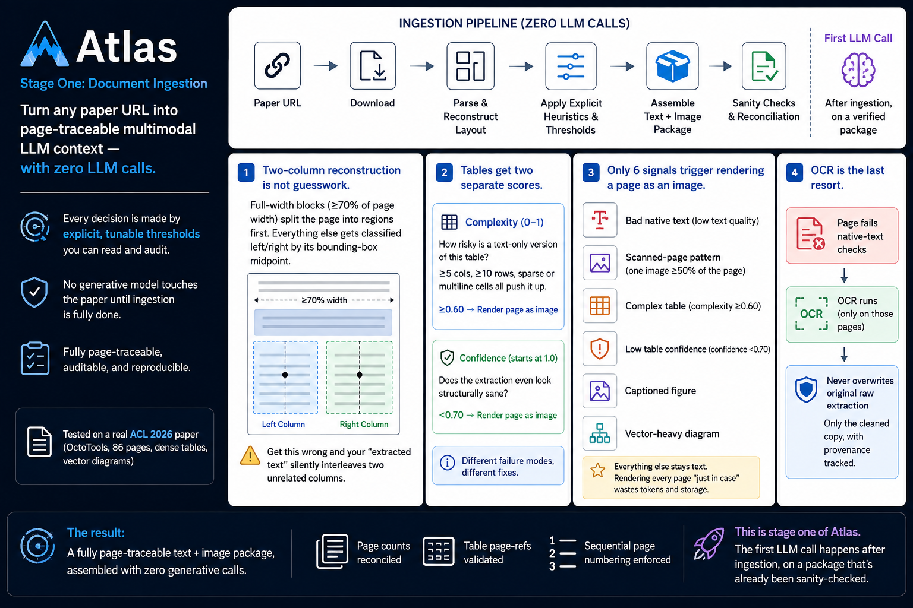

# Atlas document ingestion



Deterministic PDF-to-LLM-context ingestion for academic papers. Given a paper URL, it produces a page-traceable text representation plus a selective set of rendered page images — with zero generative model calls anywhere in the pipeline.

This is stage one of [Atlas](../), a larger project. Ingestion produces the normalized package that later Atlas stages (taxonomy extraction, reasoning) consume.

For the full design writeup — the two-column layout algorithm, the table complexity/confidence scoring, the visual-page selection signals — see [`docs/ingestion-deep-dive.md`](docs/ingestion-deep-dive.md).

## What it does

1. Resolves paper metadata and the official PDF from the landing page.
2. Downloads and validates the PDF.
3. Extracts each page's text with layout-aware two-column reconstruction.
4. Extracts tables separately, scoring each for complexity and extraction confidence.
5. Decides which pages need to be rendered as images (poor text quality, complex tables, figures, scanned pages, equations) and rasterizes only those.
6. Falls back to OCR only on pages where native text extraction failed.
7. Strips repeated running headers/footers, detects section structure, and preserves reproducibility links (GitHub, Hugging Face, etc.).
8. Validates the result (page counts, sequential numbering, table page-references) and assembles the final text + image context.

## Install

```bash
pip install -r requirements.txt
```

OCR fallback requires the Tesseract binary to be installed system-wide (only invoked for pages whose native text fails quality checks):

```bash
# macOS
brew install tesseract

# Ubuntu / Debian
sudo apt-get install tesseract-ocr
```

Requires Python 3.10+.

## Usage

Prepare a JSON file listing the papers to ingest:

```json
[
  { "anthology_id": "2026.acl-long.1", "page_url": "https://aclanthology.org/2026.acl-long.1/", "title": "OctoTools" }
]
```

Run ingestion:

```bash
python run_ingestion.py --input results/test.json --output data/ingestion
```

Each paper gets its own subdirectory under `--output`:

```
data/ingestion/2026.acl-long.1/
├── llm_context.txt      # assembled text context
└── visuals/
    ├── page_001.png      # only pages that needed visual evidence
    └── page_009.png
```

The temporary `source.pdf` used during ingestion is deleted after `llm_context.txt` is written. Progress and per-paper results are logged to both the console and a timestamped file under `logs/`.

## Configuration

All thresholds that drive ingestion decisions — text-quality minimums, table complexity/confidence cutoffs, visual-selection ratios, render/OCR DPI — are declared as named constants at the top of [`ingestion/core.py`](ingestion/core.py) with an inline comment explaining what each one controls. Nothing is hardcoded inline in the logic; adjust the constant and the behavior follows.

## Project structure

```
atlas_document_ingestion/
├── ingestion/
│   ├── core.py       # pipeline: metadata, extraction, tables, visuals, OCR, context assembly
│   └── models.py      # data shapes passed between pipeline stages
├── run_ingestion.py   # CLI entry point — batch-ingests a list of papers
├── docs/
│   └── ingestion-deep-dive.md
└── requirements.txt
```

## Known limitations

- `run_ingestion.py` matches a paper's temp PDF for cleanup using the input file's `anthology_id`. This assumes `anthology_id` equals the paper ID that `resolve_metadata()` derives from the URL — true for ACL Anthology, worth checking for other venues.
- Section detection stores one label per page, so a page where two sections both begin isn't represented with full fidelity.
- OCR failures are recorded as page-level warnings and don't stop ingestion — check `page.warnings` if you need to know which pages fell back silently.

## License

MIT — see [LICENSE](LICENSE).
