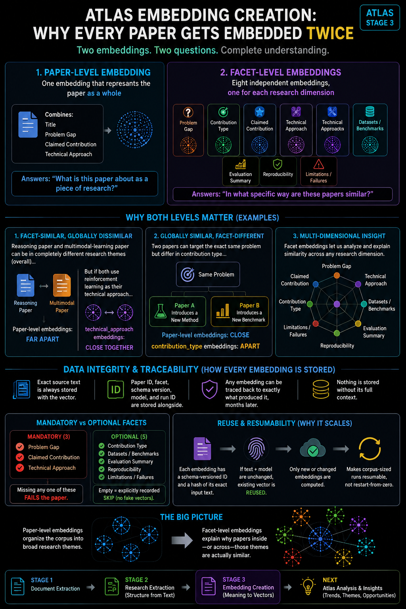

# Atlas embedding creation



This is stage four of [Atlas](../): it converts each successfully extracted
paper into vector representations, so that later stages can compare, cluster,
and search across a corpus that otherwise has no common structure at all.

## Why two representations, not one

Every paper gets embedded twice, at two different levels, because they answer
two different questions.

**Paper-level** — one embedding per paper, built from four fixed fields:
Title, Problem Gap, Claimed Contribution, Technical Approach. It answers
*"What is this paper about as a piece of research?"* — its overall research
identity. This is the representation used for whole-paper similarity,
research-theme clustering, taxonomy creation, emerging-direction detection,
and finding papers that are broadly related even when their wording differs.

**Facet-level** — one independent embedding per taxonomy field (up to eight
per paper). It answers a narrower question: *"In what particular way are
these papers similar?"* Two papers can be far apart at the paper level but
close on one specific facet — for example, a reasoning paper and a
multimodal-learning paper may sit in different research themes overall, but
both use reinforcement learning as their technical approach. Their
paper-level embeddings are far apart; their `technical_approach` embeddings
are close. Similarly, two papers can study the same broad problem but differ
in contribution type — one introduces a method, another introduces a
benchmark — and the facet-level embeddings preserve that distinction where a
single combined embedding would blur it.

Different facets support different downstream analysis:

| Facet | Supports |
|---|---|
| Problem Gap | Recurring research problems, unresolved challenges, research opportunities |
| Claimed Contribution | Contribution-pattern and novelty-shape comparison |
| Technical Approach | Method families, architecture/algorithm trends, cross-domain technique reuse |
| Datasets / Benchmarks | Dataset reuse, benchmark concentration, evaluation-ecosystem analysis |
| Contribution Type | Grouping papers by contribution shape — method, benchmark, analysis, resource |
| Evaluation Summary | Evaluation-strategy and metric-usage patterns |
| Reproducibility | Code/model/data availability trends across research areas |
| Limitations / Failures | Recurring weaknesses, common failure modes, future-research opportunities |

Together, paper-level and facet-level embeddings enable hierarchical
analysis: the paper-level view organizes the corpus into broad areas, and the
facet-level views explain *why* papers within or across those areas are
actually similar.

## Mandatory vs. optional facets

`problem_gap`, `claimed_contribution`, and `technical_approach` are mandatory
— they're fundamental enough to the representation that a paper missing any
of them fails outright rather than producing an incomplete embedding. The
remaining five facets are optional: if one is empty, no vector is created for
it, and the gap is recorded as an explicit, expected skip rather than a
failure. This keeps the pipeline from generating meaningless vectors for
missing information while still preserving an audit record of why a facet
wasn't embedded.

## Stable IDs and schema versioning

Every embedding gets a deterministic ID — `<paper_id>::paper::<schema_version>`
for the paper-level unit, `<paper_id>::<facet_name>::<schema_version>` for
each facet. The schema version exists because the semantic representation can
evolve: today's paper-level embedding combines four fields, but a future
version might add a fifth. Rather than silently changing what an existing
embedding means, a change like that gets a new schema version, so old and new
representations can coexist and later comparisons stay reproducible.

Alongside the ID, a SHA-256 hash of the exact semantic text is computed
before embedding. Before generating a new vector, the pipeline checks whether
a record with the same ID, same text hash, and same embedding model already
exists — if so, the existing vector is reused and no API call is made. This
is what makes the pipeline resumable: an interrupted run picks up only the
missing or changed embeddings on the next execution, not the whole corpus.

## Why the vector isn't stored alone

Every stored record keeps the vector together with the exact semantic text
that produced it, the paper ID, embedding type, facet, schema version,
embedding model, text hash, and run ID. That's deliberate — it means any
vector can later be inspected to answer which paper it belongs to, whether
it's paper- or facet-level, what exact text was embedded, which schema and
model produced it, and which run wrote the record. Embeddings stay
traceable rather than becoming opaque numerical artifacts.

## Audit trail and verification

Every run writes `run.log` (human-readable operational history),
`manifest.jsonl` (one line per embedding unit — created, reused, skipped, or
failed), and `summary.json` (aggregate run statistics) to its own run
directory. Execution history is kept separate from the vector database
itself, so you can inspect both the current stored state and how it came to
be that way.

Writing vectors isn't the last step. The pipeline reads every stored record
back afterward and checks that the text, hash, paper ID, embedding type,
facet, schema version, and embedding model all match, and that vector
dimensions are consistent across the run — catching storage or mapping
problems before they reach downstream analysis.

## Bring your own embedding client

Like extraction, this module doesn't ship a concrete embedding provider.
Unlike extraction's `--llm-client` (a path you pass at the CLI), this one is
wired to a fixed import: `common.oci_client`. **That module isn't included
here** — you need to provide a `common/oci_client.py` on your `PYTHONPATH`
exposing:

```python
DEFAULT_EMBED_BATCH_SIZE: int  # default value for --batch-size

def build_client():
    """Return a client object with:
        - .embedding_model_id: str
        - .embed_text(inputs: list[str], model_id: str) -> list[list[float]]
    Transport retries and authentication live inside embed_text() —
    this module only handles batching, hashing, dedup, and storage.
    """
```

Nothing about the pipeline logic in `core.py` assumes Oracle Cloud
specifically — any client matching this shape works.

## Install

```bash
pip install -r requirements.txt
```

Python 3.10+. Also requires your own `common/oci_client.py` (see above)
importable from wherever you run this.

## Usage

```bash
python -m embeddings.run_embeddings \
  --input extraction/results/results.jsonl \
  --paper-metadata results/test.json \
  --chroma-path embeddings/chroma_db
```

Run as a module (`-m embeddings.run_embeddings`) from the directory
containing both `embeddings/` and `common/`, so both packages resolve.
`--input` defaults to `../extraction/results/results.jsonl` relative to this
folder — already lined up with extraction's own default output location.

`--paper-metadata` is only needed if `results.jsonl` records don't already
carry a `title` (directly, or under `metadata.title`) — point it at a
JSON/JSONL file mapping `paper_id` to `title`.

| Flag | Purpose |
|---|---|
| `--chroma-path` | Vector store location (default: `embeddings/chroma_db`) |
| `--runs-path` | Where per-run logs/manifests are written (default: `embeddings/runs`) |
| `--batch-size` | Texts per embedding API request (default: your client's `DEFAULT_EMBED_BATCH_SIZE`) |

## Output

```
embeddings/
├── chroma_db/                       # persistent vector store
└── runs/<run_id>/
    ├── manifest.jsonl                # one line per embedding unit
    ├── run.log
    └── summary.json
```

Rerunning is safe and cheap: unchanged embeddings (same ID, same text hash,
same model) are detected and skipped before any API call.

